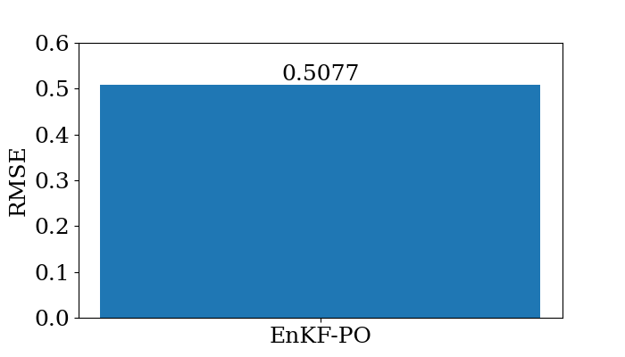

# データ同化について

## リアプノフ指数とデータ同化

リアプノフ指数は初期値が僅かに異なる2つの軌道が指数関数的に離れていく度合いを表す量である（以下の図がイメージ）．対象とする力学系のカオスを定量化する指標であり，データ同化の間隔を決める際にも使うことができる(より詳細に知りたい人は[1]を読んでください）．

　

## Lorenz63 modelのリアプノフ指数

Lorenz63 modelのリアプノフ指数を求めた（[使用したノートブック](/python/notebooks/data_assimilation/calc_lyapunov_exponent.ipynb)）．結果は約0.9であり，先行研究[2]と近い値が得られた．以下がその結果のプロットである．

　

この結果より，本モデルは約$\Delta t=1 (=1/\lambda)$で誤差が3倍程度になることがわかる．よって予測の際には誤差の発達前にデータ同化を行う必要があり，データ同化間隔を$\Delta t_{DA}=0.1$ほどにすれば上手くいくのではないかと考えられる．

## データ同化手法1: Ensemble Kalman Filter - Perturbed Observation method (EnKF-PO法)

データ同化手法の1つであるEnKFを実装した．EnKFにはいくつか種類があるのだが，ここで実装したのは観測データにノイズを加えるEnKF-PO法というものである．本手法の詳細は[3]に書かれている．またコードは[/python/src/data_assimilation/enkf/](/python/src/data_assimilation/enkf/)にある．

本手法を用いた結果を以下に示す（[使用したノートブック](/python/notebooks/data_assimilation/enkf_po/enkf_po.ipynb)）．

　

またRMSEは以下となった．

　

以上よりデータ同化が上手くいき，精度良く予測できたことがわかる．

## 参考文献

[1] [ビッグデータ同化と気象予測](https://www.jstage.jst.go.jp/article/oubutsu/90/8/90_470/_pdf)

[2] B. J. Geurts, D. D. Holm, and E. Luesink, Lyapunov exponents
in two stochastic Lorenz 63 systems, [J. Stat. Phys. 179, 1343
(2020)](https://link.springer.com/article/10.1007/s10955-019-02457-3).

[3] [データ同化入門 -次世代のシミュレーション技術-](https://www.asakura.co.jp/detail.php?book_code=12786)