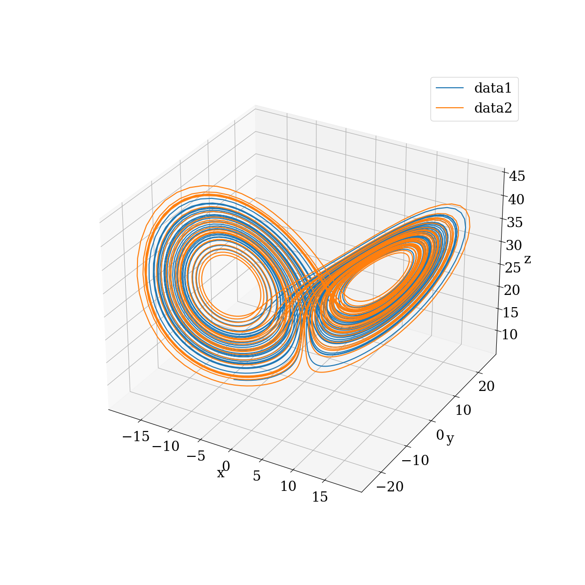
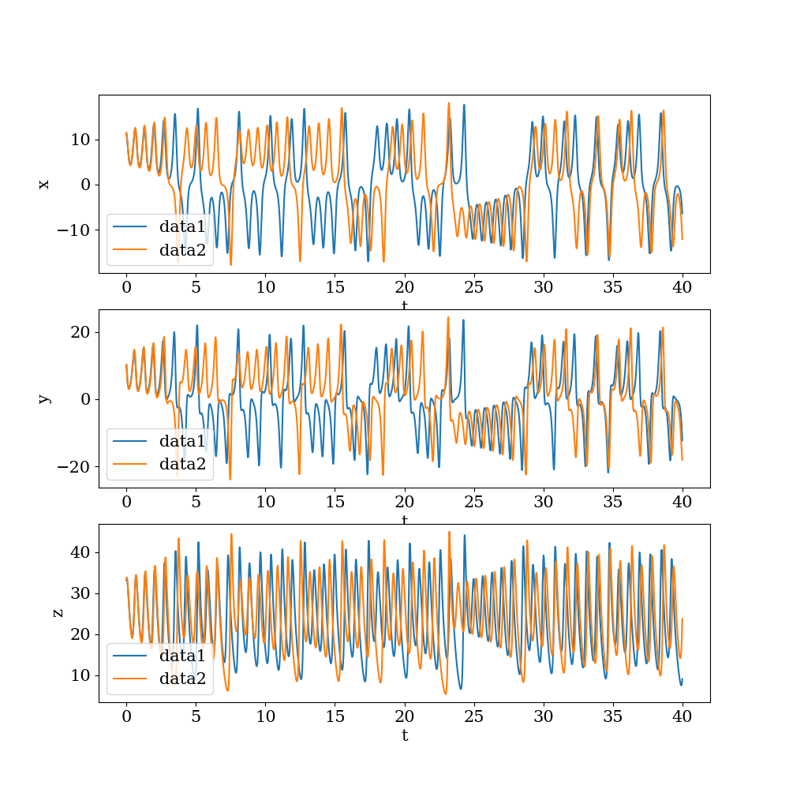
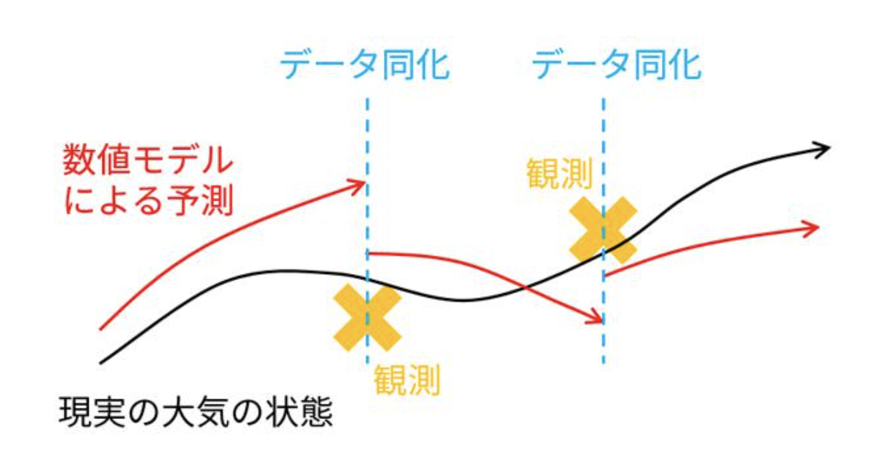

# Lorenz63 modelについて

## Lorenz63 model とは

1963年にEdward Lorenzによって提案されたモデルである[1]．熱対流を理想化した簡易的なモデルで，特定のパラメータと初期条件に対してカオスの振る舞いを示す．低次元であり扱いやすいことから，気象のデータ同化や予測可能性に関する理論的な研究でよく使われる．

本モデルは以下の3変数の常微分方程式で表される．

$$
\begin{aligned}
\frac{\text{d}x}{\text{d}t} &= \sigma (y-x) \\
\frac{\text{d}y}{\text{d}t} &= x (\rho-z) - y \\
\frac{\text{d}z}{\text{d}t} &= xy - \beta z \\
\end{aligned}
$$

$\sigma, \beta, \rho$は定数であり，今回はそれぞれ10, 8/3, 28にしている．

## 実装したコード

本モデルのコードは[/python/src/lorenz63_model/](/python/src/lorenz63_model/)にある．実装の際にはモジュールの参照が常に下の階層を向くようにして，循環参照が起こらないように気をつけた．

また本モデルを動かしたノートブックが[/python/notebook/lorenz63_model/](/python/notebooks/lorenz63_model/)にある．色々変えて動かすいいと思う．

## カオスについて

初期値が僅かに異なる2つのデータを用意し，その時間発展を計算した．その奇跡のプロットを以下に示す．

　

また$x, y, z$それぞれのプロットを以下に示す．

　

以上から初期値の僅かな違いで，その後の時間発展の結果が大きく異なることがわかる．また最初の図より，軌跡が発散することなくある有界な範囲に収まっていることがわかる．これもカオスの1つの性質である．

## 気象とカオス： データ同化の必要性

気象現象にもカオス性がある．よって単純に気象モデルを用いて気象現象を予測することはできない．そこで使われる手法がデータ同化である．

データ同化とは，観測データを用いてモデルの予測値を修正する手法である．以下の図[2]がデータ同化のイメージである．

　

今回はLorenz63 modelを用いてこのデータ同化について体験してもらうことを目的にしている．データ同化についてまとめたドキュメントは[/docs/data_assimilation/](/docs/data_assimilation/)にある．

## 参考文献

[1] Edward N. Lorenz. Deterministic nonperiodic flow. J. Atmos. Sci., 20(2):130–141, 1963. [doi:10.1175/1520-0469(1963)020<0130:DNF>2.0.CO;2](https://journals.ametsoc.org/view/journals/atsc/20/2/1520-0469_1963_020_0130_dnf_2_0_co_2.xml).

[2] [https://scienceportal.jst.go.jp/gateway/clip/20160617_01/](https://scienceportal.jst.go.jp/gateway/clip/20160617_01/)